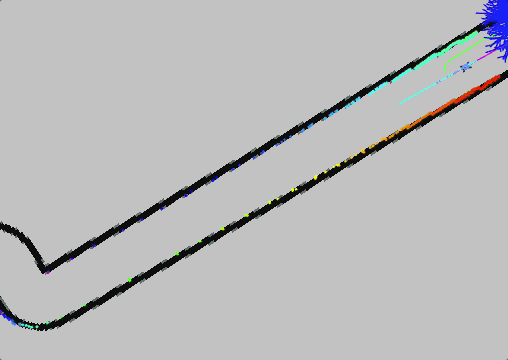

# MMPRV_F1Tenth

This repo supports [Multimodal Model Predictive Runtime Verification](https://temporallogic.org/research/MMPRV/index.html) of the [F1Tenth](https://f1tenth.org/) vehicle.

Without Monte Carlo Multimodal Prediction|  With Monte Carlo Multimodal Prediction 
:-------------------------:|:-------------------------:
 | 

- The purple/pink line is the reference trajectory of the ego-vehicle.
- The blue/cyan line is the trajectory produced by MPC that the ego-vehicle is following.
- The green line is the reference trajectory of the opponent vehicle.
- Note, there is some additional lag in the visualization on RVIZ (since the visualization messages for this simulation are massive), but the vehicle's control strategies are meeting real-time requirements.

## Prerequisites
1. Install [F1Tenth OpenAI Gym environment](https://github.com/f1tenth/f1tenth_gym).

        git clone https://github.com/f1tenth/f1tenth_gym
        cd f1tenth_gym && pip3 install -e .

2. Install [F1Tenth ROS2 Simulator](https://github.com/f1tenth/f1tenth_gym_ros).

        cd $HOME && mkdir -p sim_ws/src
        cd sim_ws/src
        git clone https://github.com/f1tenth/f1tenth_gym_ros
        source /opt/ros/foxy/setup.bash
        cd ..
        rosdep install -i --from-path src --rosdistro foxy -y

3. Install this repo.

        cd $HOME/sim_ws/src
        git clone https://github.com/aaurandt/MMPRV_F1Tenth.git
        sudo apt-get update
        sudo apt-get install ros-foxy-ackermann-msgs

4. Run the following commands:

        cd $HOME/sim_ws/src/
        mv ./MMPRV_F1Tenth/gym_bridge.rviz ./f1tenth_gym_ros/launch
        mv ./MMPRV_F1Tenth/sim.yaml ./f1tenth_gym_ros/config

5. Install [F1Tenth Racetracks](https://github.com/f1tenth/f1tenth_racetracks.git). 

        cd $HOME/sim_ws/src/
        git clone https://github.com/f1tenth/f1tenth_racetracks.git       

5. Install [OSQP](https://github.com/oxfordcontrol/osqp).

        cd $HOME/sim_ws/src
        git clone --recursive https://github.com/oxfordcontrol/osqp

6. Install [OSQPEigen](https://github.com/robotology/osqp-eigen.git).

        cd $HOME/sim_ws/src
        git clone https://github.com/robotology/osqp-eigen.git
        cd osqp-eigen
        mkdir build && cd build
        cmake ../
        make
        sudo make install

7. Build the project.

        cd $HOME/sim_ws
        colcon build

## Run the simulation
Open three terminals and run the following commands in each terminal in the order listed:
1. Run opponent vehicle running RRT*.

        cd $HOME/sim_ws
        source install/setup.bash
        ros2 run rrt_star rrt_star

2. Launch the simulator.

        cd $HOME/sim_ws
        source install/setup.bash
        ros2 launch f1tenth_gym_ros gym_bridge_launch.py

3. Run ego-vehicle running MPC.

        cd $HOME/sim_ws
        source install/setup.bash
        ros2 run mpc mpc_node

To manually move the ego-vehicle (blue) around use 2D Pose Estimate in the top bar of RVIZ.

To manually move the opponent vehicle (orange) around use 2D Goal Pose in the top bar of RVIZ.

Change values of K and N in $HOME/sim_ws/src/MMPRV_F1Tenth/mpc/mpc_node.cpp

Each run automatically writes the trace, atomic probability, and latency to a csv $HOME/sim_ws.

Reference the following repo for running MMPRV on the collected data: [https://github.com/aaurandt/MMPRV_R2U2](https://github.com/aaurandt/MMPRV_R2U2)